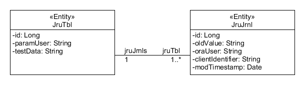

# RealJpaUser (JRU)
Test the transfer of the real user ID to the Oracle database when using connection pool


## A feladat

Hogyan lehet megoldani, hogy egy JPA pool-olt session kapcsolatban biztonságosan át tudjuk adni a DB felé a UI felületen bejelentkezett tényleges felhasználó azonosítóját?

Adott egy korábbi, több instance-ból álló Oracle RAC adatbázison(DB) alapuló rendszer, Oracle Forms felhasználói felülettel, sok ezer interaktív felhasználóval, háttérben futó batch jellegű job-okkal, stb.
Ehhez a környezethez kell illeszteni egy olyan újabb JEE7/JSF/JPA architektúrát - ami már szintén rendelkezik viszonylag számos alkalmazással - úgy, hogy a két alkalmazástér továbbra is párhuzamosan működjön tovább.

>A jelenleg megoldandó problémát az jelenti, hogy a korábbi rendszerek olyan DB trigger (after insert or update or delete) alapú audit/journal megoldást használnak, ami az adatbázis `user` SQL függvény segítségével
állapítja meg az aktuális felhasználót. A JEE környezetben a JPA pooling miatt az Alkalmazásszerver (AS) és a DB között technikai user van, így egy módosító SQL esetén a DB triggerek a technikai user account-ját
írják be az audit táblamezőkbe a tényleges felhasználó helyett.
A klasszikus JPA entitás életciklus annotációk (@Pre/PostPersist|Update|Remove) a DB triggerek miatt nem segítenek.


### A környezet

| Komponens | Technológia | Implementáció |
|-----------|-------------|---------------|
| DB | Oracle | Oracle 11g |
| AS | JEE7 | GalssFish 4.1.x/5|
| ORM | JPA | EclipseLink 2.6.1/2.7.1 |
| UI | JSF  | JSF 2.1 + PrimeFaces 6.1|


## A lehetséges megoldás

Tehát azt kell megoldani, hogy az adatbázisban a tranzakció alatt biztosítsuk azt, a triggerek számára is elérhetővé váljék az aktuális felhasználó neve, mindezt pool-ot session-okban. A feladathoz kísértetiesen hasonlít az EclipseLink VPD (Virtual Private Database) támogatása, abban szintén meg kell oldani ugyan ezt a problémát. 

Az EclipseLink a VPD műveletek számára a `DBMS_SESSION.SET_IDENTIFIER` és `DBMS_SESSION.CLEAR_IDENTIFIER` tárolt eljárások segítségével állítja be/törli a `SYS_CONTEXT('USERENV','CLIENT_IDENTIFIER')` függvény által elérhető `client_identifier` session változót. Az EclipseLink az *AbstractSession* osztály *postAcquireConnection()* és *preReleaseConnection()* session event esemény metódusain keresztül - Oracle DB esetén - az *OraclePlatform* osztály a *getVPDSetIdentifierQuery()* és a *getVPDClearIdentifierQuery()* metódusai segítségével oldja meg.


```java
/**
 * INTERNAL:
 * Return an Oracle defined VPD set identifier query.
 */
@Override
public DatabaseQuery getVPDSetIdentifierQuery(String vpdIdentifier) {
    if (vpdSetIdentifierQuery == null) {
        vpdSetIdentifierQuery = new DataModifyQuery("CALL DBMS_SESSION.SET_IDENTIFIER('" + vpdIdentifier + "')");
    }
    
    return vpdSetIdentifierQuery;
}
/**
     * INTERNAL:
     * Return an Oracle defined VPD clear identifier query.
     */
    @Override
    public DatabaseQuery getVPDClearIdentifierQuery(String vpdIdentifier) {
        if (vpdClearIdentifierQuery == null) {
            vpdClearIdentifierQuery = new DataModifyQuery("CALL DBMS_SESSION.CLEAR_IDENTIFIER()");
        }
    
        return vpdClearIdentifierQuery;
    }
```

### Az implementáció

A jelenlegi megoldás is erre a lehetőségre támaszkodik, implementálja a *postAcquireConnection()* és *preReleaseConnection()* session esemény metódusokat. Ezt az EclipseLink *org.eclipse.persistence.sessions* csomag *SessionEventAdapter* osztályának leszármaztatásával végezhetjük el, felülírjuk a két fenti metódust az alábbiak szerint. 

#### JpaSessionEventAdapter osztály


```java
package hu.btsoft.jru.core.jpa.sessionevent

import hu.btsoft.jru.core.jsf.ThreadLocalMap;
import java.sql.SQLException;
import java.sql.Statement;
import lombok.extern.slf4j.Slf4j;
import org.eclipse.persistence.exceptions.DatabaseException;
import org.eclipse.persistence.internal.databaseaccess.DatabaseAccessor;
import org.eclipse.persistence.sessions.SessionEvent;
import org.eclipse.persistence.sessions.SessionEventAdapter;

/**
 * JPA Session event adapter
 *
 * A JPA postAcquireConnection()/preReleaseConnection() eseményeire ráköltözve
 * álítjuk be/töröljük ki a DB session-ból a 'client_identifier' userenv
 * változót (Az EclipseLink VPD is így csinálja, lehet, hogy nekünk is jó lesz)
 *
 * A DB trigger innen tudja majd kiszedni az aktuális felhasználót
 *
 * A többi esemény csak a log trace kedvéért implementált, és csak logol
 *
 * @author BT
 */
@Slf4j
public class JpaSessionEventAdapter extends SessionEventAdapter {

    public static final String KEY_CLIENT_ID = "client_identifier";

    /**
     * Client ID beállítása
     *
     * PUBLIC: This event is raised on when using the server/client sessions.
     * This event is raised after a connection is acquired from a connection
     * pool.
     *
     * @param event
     */
    @Override
    public void postAcquireConnection(SessionEvent event) {

        log.trace("postAcquireConnection: {}", (String) ThreadLocalMap.get(KEY_CLIENT_ID));
        String clientIdentifier = (String) ThreadLocalMap.get(KEY_CLIENT_ID);

        //Ha van definiált 'client_identifier', akkor beállítjuk a session-nak
        if (clientIdentifier != null) {

            DatabaseAccessor accessor = (DatabaseAccessor) event.getResult();

            try (Statement stmt = accessor.getConnection().createStatement();) {

                String sql = "BEGIN DBMS_SESSION.SET_IDENTIFIER('" + clientIdentifier + "'); " + " END;";
                stmt.execute(sql);

                log.trace("SQL: {}", sql);

            } catch (DatabaseException e) {
                log.error("DB Error", e);
            } catch (SQLException e) {
                log.error("SQL Error", e);
            }
        }

    }

    /**
     * Client ID törlése
     *
     * PUBLIC: This event is raised on when using the server/client sessions.
     * This event is raised before a connection is released into a connection
     * pool.
     *
     * @param event
     */
    @Override
    public void preReleaseConnection(SessionEvent event) {

        log.trace("preReleaseConnection: {}", (String) ThreadLocalMap.get(KEY_CLIENT_ID));

        //Ha van definiált 'client_identifier', akkor töröljük a session-ból
        String clientIdentifier = (String) ThreadLocalMap.get(KEY_CLIENT_ID);
        if (clientIdentifier != null) {

            DatabaseAccessor accessor = (DatabaseAccessor) event.getResult();

            try (Statement stmt = accessor.getConnection().createStatement();) {

                final String SQL = "BEGIN DBMS_SESSION.CLEAR_IDENTIFIER; END;";
                stmt.execute(SQL);

                log.trace("SQL: {}", SQL);

            } catch (DatabaseException e) {
                log.error("DB Error", e);
            } catch (SQLException e) {
                log.error("SQL Error", e);
            }
        }
    }
```
<span style="font-size: 0.7em;">
(Mivel ez csak egy implementációs teszt, így sokat logol, és a hibakezelések szofisztikáltabb implementációja sem annyira
neuralgikus pont.) 
</span>


#### JPA persistence.xml
Az EclipseLink session event listener élesítése a *persistence.xml* fájlban megadott *eclipselink.session-event-listener* property-jében végezhető el.

```xml
<?xml version="1.0" encoding="UTF-8"?>
<persistence version="2.1" 
             xmlns="http://xmlns.jcp.org/xml/ns/persistence" 
             xmlns:xsi="http://www.w3.org/2001/XMLSchema-instance" 
             xsi:schemaLocation="http://xmlns.jcp.org/xml/ns/persistence http://xmlns.jcp.org/xml/ns/persistence/persistence_2_1.xsd">
    
    <persistence-unit name="JruTest-PU" transaction-type="JTA">
        <provider>org.eclipse.persistence.jpa.PersistenceProvider</provider>
        <jta-data-source>jdbc/jruTest</jta-data-source>
        <exclude-unlisted-classes>false</exclude-unlisted-classes>
        <properties>
            <property name="eclipselink.session-event-listener" value="hu.btsoft.jru.core.jpa.sessionevent.JpaSessionEventAdapter"/>

            <!-- GF 4.1.x esetén -->
            <!--<property name="eclipselink.logging.logger" value="JavaLogger"/>-->

            <!-- GF 5 esetén -->
            <property name="eclipselink.logging.logger" value="org.eclipse.persistence.logging.slf4j.SLF4JLogger"/>
```

A fentiekből következik, hogy az esemény figyelőnk példányosítását és kezelését az EclipseLink JPA provider végzi. Viszont az eseménymetódusok szignatúrája nem teszi lehetővé azt, hogy további információkat adjuk át a példánynak, így a felhasználó azonosítójának átadását még meg kell oldani. Erre egy JEE környezetben nem túl sok mód adódik, de talán a legegyszerűbb egy ThreadLocal változó bevetése.

#### JPA entitás műveletek osztályai (DAL/DAO/Service/stb...)

A fenti kód egy *ThreadLocalMap* osztályban veszi át az aktuális felhasználó azonosítóját a 'client_identifier' Map kulcson. Ha ez a kulcs létezik, akkor meghívja a tárolt eljárást az adatbázis művelet előtt és után, ha nem létezik akkor nem. Ezzel a módszerrel biztosítható az, hogy az alkalmazás korábbi kódbázisainak működésében ne okozzunk változást, új kódok esetén csak ezt a változót kell beállítani a módosító DB műveletek hívása előtt. (Bár akár egy SQL lekérdezésben is lehetnek olyan eljárás- vagy függvényhívások, amik audit logot vezethetnek, így talán érdemesebb minden olyan DB hívásba beépíteni, ahol már ismert az interaktív UI felhasználó)


```java
import hu.btsoft.jru.core.jpa.sessionevent.JpaSessionEventAdapter;
import hu.btsoft.jru.core.jsf.ThreadLocalMap;
import hu.btsoft.jru.model.entity.JruJrnl;
import hu.btsoft.jru.model.entity.JruTbl;
import java.security.Principal;
import java.util.List;
import javax.annotation.Resource;
import javax.ejb.SessionContext;
import javax.ejb.Stateless;
import javax.persistence.EntityManager;
import javax.persistence.PersistenceContext;
import javax.persistence.Query;
import lombok.extern.slf4j.Slf4j;

@Stateless
@Slf4j
public class EntityService {

    @PersistenceContext
    private EntityManager em;

    @Resource
    private SessionContext ctx;

    /**
     * Entitás létrehozása és elmentése
     *
     * @param testdata    teszt adat
     * @param currentUser bejelentkezett user
     *
     * @return mentett entitás
     */
    private JruTbl persist(String testdata, String currentUser) {

        //Eltesszük egy threadlocal változóba a kliens ID-t
        ThreadLocalMap.put(JpaSessionEventAdapter.KEY_CLIENT_ID, currentUser);

        JruTbl entity = new JruTbl();
        entity.setParamUser(currentUser);
        entity.setTestData(testdata);
        em.persist(entity);

        log.trace("doTest end, id: {}", entity.getId());

        return entity;
    }
```


Persze pont ez az Achilles sarka ennek a megoldásnak: ha a *ThreadLocalMap.put(JpaSessionEventAdapter.KEY_CLIENT_ID, currentUser);* hívást elfelejtjük kiadni, akkor marad az eredeti probléma: az audit a JPA technikai user-el fog megtörténni. Bár ezen lehetne segíteni egy az osztályra/metódusra ráhúzott inteceptor segítségével...

Biztosítani kell még azt (mivel pool-olt a session), hogy a kliens session kapcsolat elengedésével mindenképpen törlődjön a *ThreadLocalMap* ezen kulcsa. Ezt a *JpaSessionEventAdapter* osztály *postReleaseClientSession()* metódusában végezzük. 

```java
/**
     * A 'client_identifier' ThreadLocal változót a biztonság kedvéért
     * mindenképpen töröljük!
     *
     * PUBLIC: This event is raised on the client session after releasing.
     *
     * @param event
     */
    @Override
    public void postReleaseClientSession(SessionEvent event) {

        //Ha a klien kilép az adatbázisból, akkor töröljük a ThreadLocal 'client_identifier' változót
        log.trace("postReleaseClientSession: {}", (String) ThreadLocalMap.get(KEY_CLIENT_ID));
        ThreadLocalMap.remove(KEY_CLIENT_ID);

        log.trace("postReleaseClientSession: KEY_CLIENT_ID törölve -> {}", (String) ThreadLocalMap.get(KEY_CLIENT_ID));
    }
```
>A fenti *EntityService* demó osztály *persist()* metódusában ne is próbálkozzunk a törléssel: mikor a metódus már visszaadta a vezérlést, >addig még bőven folynak JPA műveletek az adatbázisban.


### A teszt futtatás

A teszt során a felhúzott session event listener már végzi a dolgát: minden releváns SQL utasítás előtt/után végrehajtódik a `client_identifier` DB oldali változó automatikus beállítása és törlése, valamint az adott szál *ThreadLocalMap*  kulcsának a törlése is.

<span style="font-size:0.6em">
<pre><code>
Info:   15:33:23.733 TRACE - [http-listener-1(4)] - hu.btsoft.jru.model.service.EntityService(doTest:77)         - -------------------------------------------------------------------------------------------------------------------------------------------
Info:   15:33:23.733 TRACE - [http-listener-1(4)] - hu.btsoft.jru.model.service.EntityService(doTest:78)         - doTest('test data', 'user001')
Info:   15:33:23.749 DEBUG - [http-listener-1(4)] - eclipselink.logging.connection(log:59)                       - client acquired: 1873423915
Info:   15:33:23.755 TRACE - [http-listener-1(4)] - eclipselink.logging.connection(log:47)                       - Connection acquired from connection pool [read]
Info:   15:33:23.755 TRACE - [http-listener-1(4)] - eclipselink.logging.connection(log:47)                       - reconnecting to external connection pool
Info:   15:33:23.814 TRACE - [http-listener-1(4)] - essionevent.JpaSessionEventAdapter(postAcquireConnection:53) - postAcquireConnection: user001
Info:   15:33:23.848 TRACE - [http-listener-1(4)] - essionevent.JpaSessionEventAdapter(postAcquireConnection:66) - SQL: <b>BEGIN DBMS_SESSION.SET_IDENTIFIER('user001');  END;</b>
Info:   15:33:23.848 DEBUG - [http-listener-1(4)] - eclipselink.logging.sql(log:59)                              - SELECT SCHEMAOWNER.JRU_SEQ.NEXTVAL FROM DUAL
Info:   15:33:23.915 TRACE - [http-listener-1(4)] - sessionevent.JpaSessionEventAdapter(preReleaseConnection:88) - preReleaseConnection: user001
Info:   15:33:23.929 TRACE - [http-listener-1(4)] - essionevent.JpaSessionEventAdapter(preReleaseConnection:101) - SQL: <b>BEGIN DBMS_SESSION.CLEAR_IDENTIFIER; END;</b>
Info:   15:33:23.931 TRACE - [http-listener-1(4)] - eclipselink.logging.connection(log:47)                       - Connection released to connection pool [read].
Info:   15:33:23.932 TRACE - [http-listener-1(4)] - eclipselink.logging.sequencing(log:47)                       - sequencing preallocation for JRU_SEQ: objects: 50 , first: 7, last: 56
Info:   15:33:23.932 TRACE - [http-listener-1(4)] - eclipselink.logging.sequencing(log:47)                       - assign sequence to the object (7 -> JruTbl(id=null, paramUser=user001, testData=test data, jruJrnl=null))
Info:   15:33:23.936 TRACE - [http-listener-1(4)] - hu.btsoft.jru.model.service.EntityService(persist:61)        - doTest end, id: 7
Info:   15:33:23.947 TRACE - [http-listener-1(4)] - eclipselink.logging.connection(log:47)                       - Connection acquired from connection pool [default].
Info:   15:33:23.947 TRACE - [http-listener-1(4)] - eclipselink.logging.connection(log:47)                       - reconnecting to external connection pool
Info:   15:33:23.954 TRACE - [http-listener-1(4)] - essionevent.JpaSessionEventAdapter(postAcquireConnection:53) - postAcquireConnection: user001
Info:   15:33:23.955 TRACE - [http-listener-1(4)] - essionevent.JpaSessionEventAdapter(postAcquireConnection:66) - SQL: <b>BEGIN DBMS_SESSION.SET_IDENTIFIER('user001');  END;</b>
Info:   15:33:23.955 DEBUG - [http-listener-1(4)] - eclipselink.logging.sql(log:59)                              - INSERT INTO SCHEMAOWNER.JRU_TBL (ID, PARAM_USER, TXT) VALUES (?, ?, ?)
	bind => [7, user001, test data]
Info:   15:33:23.958 TRACE - [http-listener-1(4)] - sessionevent.JpaSessionEventAdapter(preReleaseConnection:88) - preReleaseConnection: user001
Info:   15:33:23.962 TRACE - [http-listener-1(4)] - essionevent.JpaSessionEventAdapter(preReleaseConnection:101) - SQL: <b>BEGIN DBMS_SESSION.CLEAR_IDENTIFIER; END;</b>
Info:   15:33:23.962 TRACE - [http-listener-1(4)] - eclipselink.logging.connection(log:47)                       - Connection released to connection pool [default].
Info:   15:33:23.964 DEBUG - [http-listener-1(4)] - eclipselink.logging.connection(log:59)                       - client released
Info:   15:33:23.964 TRACE - [http-listener-1(4)] - onevent.JpaSessionEventAdapter(postReleaseClientSession:123) - postReleaseClientSession: user001
Info:   15:33:23.964 TRACE - [http-listener-1(4)] - onevent.JpaSessionEventAdapter(postReleaseClientSession:126) - postReleaseClientSession: KEY_CLIENT_ID törölve -> null
</pre></code></span>


A megoldás terheléses tesztje egy egyidejűleg 100, a UI felületre bejelentkező, egy interaktív felhasználó kattintgatását szimuláló (felhasználónként 50 véletlenszerű tesztadatot beküldő és mindezt 5 iterációban megismétlő) környezetben is hibátlanul teljesített, így valószínűleg érdemes vele tovább foglalkozni.  


## A tesztkörnyezet kialakítása


### Adatbázis objektumok

Az adatbázis oldal végtelenül leegyszerűsített, de mégis a valós környezetben zajló folyamatokhoz közelítő modell, amelyben két tábla van. A `JruTbl` az adatttáblát reprezentálja, ahova a felhasználók és egyéb háttérfolyamatok dolgoznak, valamint a `JruJrnl` journal tábla, amelyet a jruTbl-re akasztott adatbázis trigger tölt. Mindkét tábla ID-jét egy adatbázis szekvenciából tölti fel egy egy trigger. Az adatbázis objektumok a `schemaowner` Oracle account tulajdonában vannak, míg a JPA a `jpauser` technikai account-al dolgozik az adatbázisban és a `jru_role` szerepkörön keresztül éri el az adattáblákat.

   


A `JruTbl` táblába JPA oldalról két adatot küldünk:
- Egy véletlenszerű szöveges adatot
- A UI felületen bejelentkezett valós felhasználó azonosítóját. (Majd ezzel tudjuk a trigger által kiolvasott felhasználó neveket összevetni.)

A `JruJrnl` táblát egy szokásos (<code>after insert or update or delete</code>) journal trigger írja, ami viszont inkább figyelmet érdemel, hogy viszonylag egyszerűen lehet megállapítani a változást kiváltó felhasználó azonosítóját.  A leírás elején említett legacy Oracle Forms-os triggereket így csak az alábbiak szerint kell majd módosítani, ha a módosító user-t szeretnék megállapítani.

```sql
select NVL(SYS_CONTEXT('userenv', 'client_identifier'), user) FROM dual
```

#### Adatbázis objektumok beállítása

>Figyelem: A leírásban szereplő scriptek, cmd és más állományok elindítása előtt mindig ellenőrizzük, fussuk át őket, és **írjuk át a saját környezetünknek megfelelően!**

1) Egy 'nyers' adatbázis kialakítását a [setup/db-setup/1-run-from-sys.sql](setup\db-setup\1-run-from-sys.sql) SYSDBA szerepkörrel rendelkező user alól történő indításával kezdhetjük el, amely az alábbiakat hozza létre: 
- `testtblspc` táblatér (a teszt után a teljes táblatér eldobható)
- `schemaowner` user
- `jpauser` user
- `jru_role` szerepkört, és a `jpauser`-nek adja


2) A `schemaowner`-be bejelentkezve indítsuk el a [setup/db-setup/2-run-from-schemaowner.sql](setup\db-setup\2-run-from-schemaowner.sql) scriptet, amely az alábbiakat végzi el:
- droppol minden korábban, ebben a scriptben használt  létrehozott objektumot
- táblák, indexek, szekvenciák, triggerek
- grantok kiadása 


#### GalssFish beállítása
Ellenőrizzük és írjuk át a GF_ASDAMIN_HOME környezeti változó értékét, esetleg a létrehozandó tesz userek számát (testUsersCnt), majd indítsuk el a [setup\gf-setup\GlassFish-config.cmd](setup\gf-setup\GlassFish-config.cmd) parancs állományt. Ez létrehozza a GalssFish példányunk default domain-jében az alábbiakat:
- jru-fileRealm fileRealm
- admin usert, JRU_USER és JRU_ADMIN szerepkörrel (jelszó: pass12)
- user001...user100 teszt user-t, JRU_USER szerepkörrel (jelszó: pass12)


Ezekkel a lépésekkel a tesztkörnyezet tulajdonképpen meg is is van.

### UI felület

A fejlesztéshez és a próbálgatáshoz készült, a feladat szempontjából nincs túl nagy jelentősége. A projekt build-je és deploy után be is jelentkezhetünk (url: http://localhost:8080/JruTest)


      


A felület nem túl bonyolult: a bejelentkezett user küldhet teszt adatokat, a hibák megjelenítésére csak az admin usernek van joga, leginkább a JMeter-es teszt lebonyolítása miatt került kialakításra, talán elég ennyi róla.


## Stressz teszt

A megoldás valódi működőképességének komolyabb tesztelését pl.: egy JMeter projekt segítségével lehet ellenőrizni. A JMeter segítségével több virtuális felhasználót tudunk ráereszteni az UI felületre:
- bejelentkeztetni
- adatot íratni az input mezőbe
- megnyomatni vele a submit gombot, ezt ismételjük párszor
- majd kilép az user a logout gombra klikkelve

Mindezt úgy, hogy közben szimuláljuk a létező leggyorsabb valós user 'klikkelgetési' teljesítményét: az egyes műveletek között un: `ThinkingTime` időt várunk, ami itt szálanként véletlenszerűen 1.5..3.5 másodperc lesz. (Ha növeltük a GlassFish teszt userek számát, akkor javítsunk a [jmeter\create-jmeter-test-users.cmd](jmeter\create-jmeter-test-users.cmd) állomány *testUsersCnt* változóján, majd indítsuk el a parancs állományt.) A jelenlegi beállításokkal 25.000 tranzakció lesz.


- Töltsük be a JMeter-be a [jmeter\jrutest-plan.jmx]() állományt
- Az 'User Defined Variables'-ben ellenőrizzük, és szüksége esetén változtassunk az értékeken
 
    

- Indítsuk el a JMeter projektet (Érdemes a JruTest projekt LogBack log level szintjét Warn-ra állítani a teszt közben, akár menet közben is lehet...)

    

- A teszt futása közben fél szemmel érdemes a GlassFish naplóját is figyelemmel kísérni
- Ha a JMeter végzett, akkor esetleg érdemes átnézni a jelentéseket

    

- **Mindenképpen ellenőrizzük az adatokat az adatbázisban**: keressünk olyan rekordokat, ahol a `JruTbl.param_user` mezője nem egyezik a megfelelő `JruJrnl.client_identifier` mezőjével. **Ha nincs ilyen, akkor minden rendben.**
```sql
-- Search for faulty records where the username is different
select *
  from jru_tbl t
 inner join JRU_JRNL j
    on t.id = j.jru_tbl_id
 where t.param_user != j.client_identifier
 order by j.mod_timestamp desc;
```


[]()

